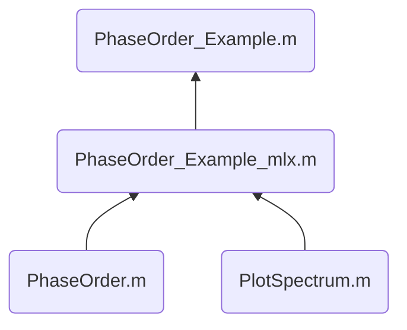

  

### 基本信息

**存储路径：**`~/Model/`

**问题来源**：当输入信号频率 Fin 非常接近奈奎斯特频率 Fs/2 时，采样波形此时已无法看出波形的本质了，当我们使用 FFT 对信号进行处理时，**往往会忽略 FFT 信号中的相位信息**，对我们 debug 没有任何帮助；

**解决方法**：对输入信号**根据相位大小进行重排**，将原本N个看似“不完整“的正弦信号整理为 [0, 2*pi) 的一个正弦信号；

---

### 文件结构：

  

---

### 函数介绍

- :star: `PhaseOrder.m`: 根据输入信号进行重排，不支持向量输入，返回带有 `Index`, `Value`, `PhaseOrder` 的 **table**;

- `PlotSpectrum.m`: 根据输入信号绘制频谱图，**支持向量输入**，返回频率点 f (Hz) 与 对应功率谱 P (dB);

-