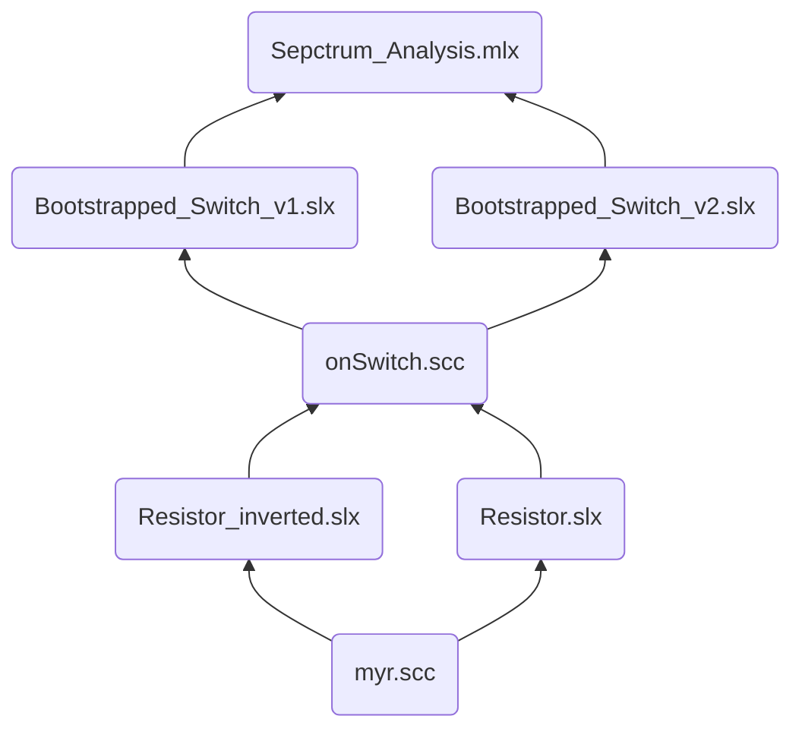

**存储路径：** `~/Simulink/`

  

**问题来源：** 在没有 Cadence Virtuoso 的情况下，利用 Simulink **对自举开关的源漏互换行为**进行建模；

  

**解决方案：** 以 Simulink 自带的 `Variable Resistance` 为基础，修改模型文件使得导通电阻满足源漏互换特性，即：

  

- 导通电阻阻值 $R_{on}$ 与两端电压 $V_1 - V_2$ 有关；

- 当两端电压 $V_1 - V_2 > 0$ 时，导通电阻阻值 $R_{on} \propto V_1 - V_2$ ;

- 当两端电压 $V_1 - V_2 < 0$ 时，导通电阻阻值 $R_{on} = R_{on0}$ ;

  

#### 文件结构：

  

  

#### 函数介绍

- `myr.scc`：根据 **variable resistor** 改编而来，输入为电阻R0， 输出为Min{R_max, R}；

  

- `Resistors.slx`, `Resistor_inverted.slx`: 为 **myr.scc** 的两个仿真测试文件，基本已弃用;

  

- :star:`onSwitch.scc`: 根据 **myr.scc** 改编而来，含有4个 `electrical node`，**vp,vn** are used to sense the control voltage, **导通电阻阻值符合MOSFET的源漏互换行为**；

  

- :star:`Bootstrapped_Switch_v1.slx`,`Bootstrapped_Switch_v2.slx`: 为 **onSwitch.scc** 的两个仿真测试文件，输出信号导出至 workspace，用 `Spectrum_Analysis.mlx` 文件计算输出信号的总谐波失真 THD；

  

-