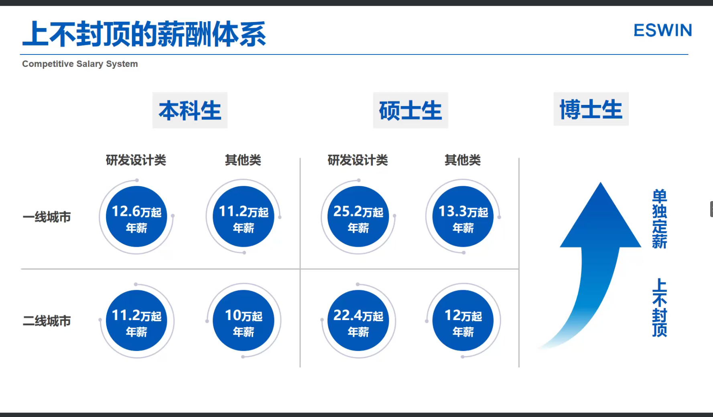
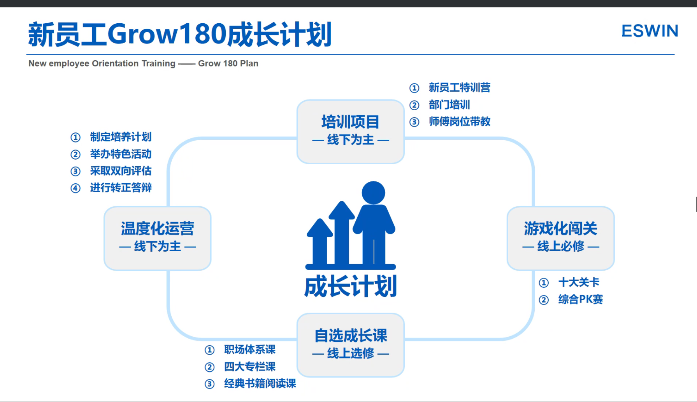
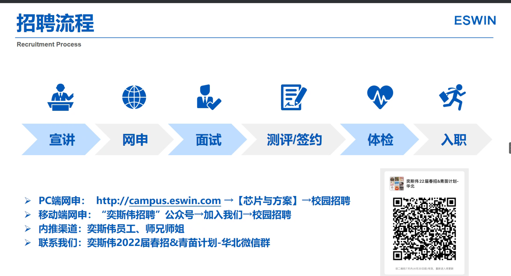
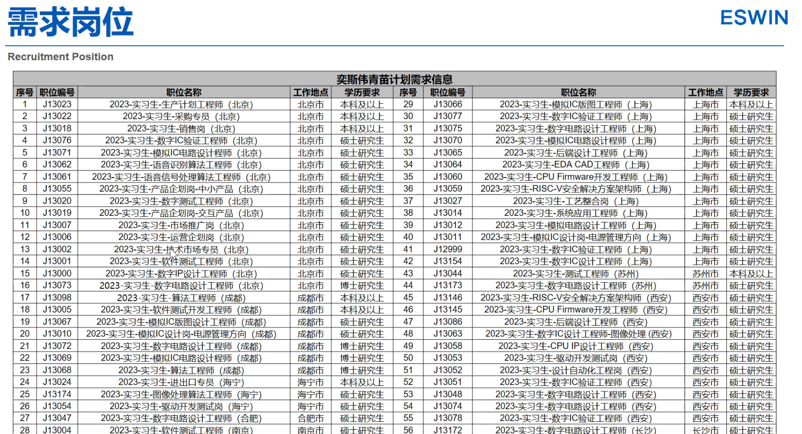

# 奕斯伟2022届校园招聘宣讲会
[校招链接](http://campus.eswin.com)

---

## 1. 关于奕斯伟

- 公司英文名：**E-Solution to win**； 
- 国家年投资100-150亿；
- 现有员工2000+；
- 核心事业：**芯片与方案**、硅材料、先进封测；
- 公司总部：北京亦庄；
- 研发中心：北京、海宁、合肥、**上海**、南京、长沙、**苏州**；
  
### 芯片设计：
- 显示芯片
- 智能物联芯片
- 智能连接芯片
- 智能计算加速芯片

## 2. 校招生、实习生的工作收获

- 北京有户口与员工宿舍；
- 住房公积金最高；

### 新员工Grow180成长计划

- 应届生合同5年，其中前半年为**试用期**；
- 住宿是**两人间**；

### 学长分享经验

- 浙江海宁工作；
- 8:30 - 9:00 打卡，中午午休一个小时，**下午5：30下班**；
- 员工宿舍与公司骑行很近；

## 3. 校招流程

- 提前实习的时间计算在**半年的试用期**内；
- 2022届校园招聘需求：
  - 模拟IC设计工程师；

### 青苗计划
- 针对面向海内外在校大学生开放的实习生培养项目；
- 针对**2023年及以后毕业**的本科、硕士、博士在校生及留学生；
- [网申地址](http://campus.eswin.com)

#### 答疑
- 内推、网申相差不大；
- 周六周日双休，（半导体行业不加班白名单）；
- 第一年没有KPI要求，第二年之后会出现KPI要求；
- 投递没有回应的联系HR；